# Immutable & Indestructible Pipeline — FinCorp Secure Software Supply Chain

**AWS Account:** `195275642256` | **Primary Region:** `us-east-1` | **DR Region:** `eu-west-1`

---

## Table of Contents

1. [Project Overview](#1-project-overview)
2. [Architecture Overview](#2-architecture-overview)
3. [CI/CD Pipeline Flow](#3-cicd-pipeline-flow)
4. [ECR Security Configuration](#4-ecr-security-configuration)
5. [AWS CodeArtifact Setup](#5-aws-codeartifact-setup)
6. [Terraform Infrastructure](#6-terraform-infrastructure)
7. [RDS Primary Database](#7-rds-primary-database)
8. [AWS Backup Configuration](#8-aws-backup-configuration)
9. [Disaster Recovery Simulation](#9-disaster-recovery-simulation)
10. [GitHub Secrets Configuration](#10-github-secrets-configuration)
11. [Challenges and Fixes](#11-challenges-and-fixes)
12. [Lessons Learned](#12-lessons-learned)

---

## 1. Project Overview

FinCorp required a software supply chain that satisfies four security guarantees:

| Requirement | Implementation |
|-------------|----------------|
| No direct access to public package registries from CI builds | AWS CodeArtifact proxies npm and PyPI — all dependencies route through an audited, account-owned endpoint |
| Docker images cannot be silently replaced after publication | Amazon ECR tag immutability — any attempt to overwrite an existing tag is rejected by the API |
| Vulnerable images must never reach production | ECR scan-on-push + a pipeline vulnerability gate that hard-fails on any HIGH or CRITICAL CVE |
| Database must survive a regional failure | AWS Backup daily snapshots with automatic cross-region copy to `eu-west-1`; full restore validated under 30 minutes |

The entire infrastructure is defined as code in Terraform and deployed automatically. The CI/CD pipeline runs on GitHub Actions and is authenticated to AWS using short-lived credentials stored in GitHub Secrets — no credentials are hardcoded anywhere in the repository.

### Repository Structure

```
.
├── .github/
│   └── workflows/
│       └── ci-cd.yml              # GitHub Actions pipeline
├── app/
│   ├── index.js                   # Express.js application (Node.js 20)
│   └── package.json               # Node.js dependencies
├── docs/
│   └── images/                    # Screenshots for this document
├── terraform/
│   ├── main.tf                    # Terraform version block + all locals
│   ├── providers.tf               # AWS provider config (primary + DR), account lock
│   ├── variables.tf               # Input variables
│   ├── outputs.tf                 # Post-apply outputs
│   ├── ecr.tf                     # Amazon ECR repository + lifecycle policy
│   ├── codeartifact.tf            # CodeArtifact domain + npm/pip repositories
│   ├── rds.tf                     # RDS PostgreSQL instance + subnet group
│   ├── backup.tf                  # AWS Backup vaults, plan, and cross-region copy
│   ├── security_group.tf          # VPC security group + data sources
│   └── iam.tf                     # IAM role for AWS Backup
├── Dockerfile                     # Container build (node:20-alpine3.21)
├── requirements.txt               # Python dependency for pip proxy demo
├── .dockerignore                  # Prevents auth files leaking into build context
├── .gitignore
└── README.md
```

---

## 2. Architecture Overview

```
┌─────────────────────────────────────────────────────────────────────┐
│                         GitHub Actions Runner                        │
│                                                                     │
│  push/PR to main         CodeArtifact Login                         │
│       │                  ┌──────────────────────┐                  │
│       ▼                  │  fincorp-domain        │                  │
│  Checkout repo           │  ├─ fincorp-npm-proxy  │◄── npm install  │
│       │                  │  └─ fincorp-pypi-proxy │◄── pip install  │
│       ▼                  └──────────────────────┘                  │
│  Build Docker image                                                 │
│       │                                                             │
│       ▼                                                             │
│  Push → ECR (fincorp-app-repo)                                      │
│       │    image_tag_mutability = IMMUTABLE                         │
│       │    scan_on_push = true                                      │
│       ▼                                                             │
│  Wait for scan COMPLETE                                             │
│       │                                                             │
│       ▼                                                             │
│  Vulnerability gate ── HIGH > 0 OR CRITICAL > 0 ──► FAIL & block   │
│                     └─ all clear ──────────────────► PASS           │
└─────────────────────────────────────────────────────────────────────┘

┌──────────────────────────── Terraform (us-east-1) ─────────────────┐
│                                                                     │
│  Default VPC                                                        │
│  ├── Security Group: fincorp-rds-postgres-sg                       │
│  │     └── port 5432 inbound: VPC CIDR only                        │
│  │                                                                  │
│  └── RDS PostgreSQL 16.3 (db.t4g.small)                            │
│        └── fincorp-rds-primary                                      │
│              └── publicly_accessible = false                        │
│                                                                     │
│  AWS Backup                                                         │
│  ├── Vault: fincorp-backup-vault (us-east-1)                       │
│  ├── Plan:  cron(0 5 * * ? *) — daily 05:00 UTC                    │
│  │     └── copy_action ──────────────────────────────────────────► │
│  └── IAM Role: fincorp-aws-backup-role                             │
│                                                                     │
└─────────────────────────────────────────────────────────────────────┘
                                                                      │
                              cross-region copy                       │
                                                                      ▼
┌──────────────────────────── Terraform (eu-west-1) ─────────────────┐
│                                                                     │
│  AWS Backup DR Vault: fincorp-backup-vault-dr                      │
│  └── 30-day retention                                               │
│  └── start-restore-job → fincorp-rds-dr-restore                    │
│                                                                     │
└─────────────────────────────────────────────────────────────────────┘
```

**Key design decisions:**
- Both AWS providers carry `allowed_account_ids = ["195275642256"]` — Terraform refuses to plan against any other account, preventing mis-targeted deploys
- The DR region was originally `us-west-2` but was changed to `eu-west-1` after an AWS Service Control Policy (SCP) at the organisation level blocked Backup operations in `us-west-2`
- CodeArtifact is split into two repositories because AWS enforces one external connection per repository

---

## 3. CI/CD Pipeline Flow

**File:** `.github/workflows/ci-cd.yml`
**Triggers:** push to `main` or `release/**`; pull requests to `main`; manual dispatch

### Pipeline Steps

| # | Step | Detail |
|---|------|--------|
| 1 | Checkout | Fetches repo at the triggering commit SHA |
| 2 | Setup Node.js 20 | Runtime for the application |
| 3 | Setup Python 3.12 | Runtime for the pip proxy test |
| 4 | Configure AWS credentials | Reads `AWS_ACCESS_KEY_ID` + `AWS_SECRET_ACCESS_KEY` from GitHub Secrets — no hardcoded values |
| 5 | Resolve account ID | `aws sts get-caller-identity` → `$AWS_ACCOUNT_ID` |
| 6 | npm → CodeArtifact | `aws codeartifact login --tool npm --repository fincorp-npm-proxy` rewrites `.npmrc` on the runner |
| 7 | pip → CodeArtifact | `aws codeartifact login --tool pip --repository fincorp-pypi-proxy` |
| 8 | `npm install` | Packages fetched through the CodeArtifact npm proxy and cached there |
| 9 | `pip install` | Packages fetched through the CodeArtifact pip proxy |
| 10 | ECR login | Docker authenticated to `195275642256.dkr.ecr.us-east-1.amazonaws.com` |
| 11 | Ensure ECR repo exists | Idempotent: creates with `IMMUTABLE` + `scanOnPush=true` if absent |
| 12 | Docker build + tag | Base image `node:20-alpine3.21`; tagged with `github.sha` |
| 13 | Push to ECR | Image stored under the immutable commit SHA tag |
| 14 | Start image scan | `aws ecr start-image-scan` |
| 15 | Wait for `COMPLETE` | Polls every 10 s up to 3 minutes; exits on `COMPLETE` or `FAILED` |
| 16 | Vulnerability gate | `jq '.findingSeverityCounts.HIGH // 0'` and `.CRITICAL // 0` — fails build if either > 0 |

### Pipeline Success

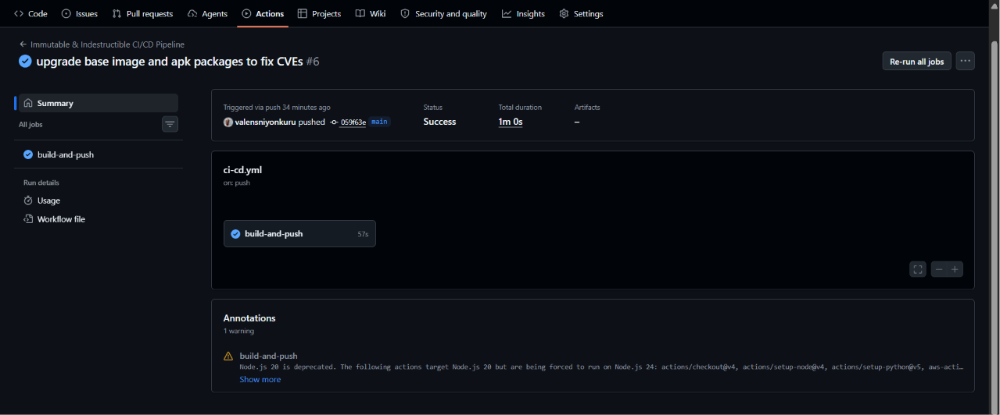

### Vulnerability Gate in Action

The gate uses `jq`'s `// 0` alternative operator to safely default null severity counts to zero, preventing crashes when a clean image has no findings at all:

```bash
HIGH=$(echo "$SCAN_RESULTS"     | jq '.imageScanFindings.findingSeverityCounts.HIGH     // 0')
CRITICAL=$(echo "$SCAN_RESULTS" | jq '.imageScanFindings.findingSeverityCounts.CRITICAL // 0')

if [ "$HIGH" -gt 0 ] || [ "$CRITICAL" -gt 0 ]; then
  echo "FAIL: High or Critical vulnerabilities detected — blocking deployment."
  exit 1
fi
```

---

## 4. ECR Security Configuration

Amazon ECR is configured with two security controls that together make published images immutable and continuously scanned.

### Tag Immutability

`image_tag_mutability = "IMMUTABLE"` is set in `terraform/ecr.tf`. Once an image is pushed with a given tag (in this pipeline, the commit SHA), no subsequent push can overwrite it. Any re-push of the same tag is rejected by ECR with a 400 error. This prevents:
- Accidental overwrites of a known-good image
- Supply chain attacks that replace a trusted tag with a malicious image

### Scan on Push

`scan_on_push = true` triggers ECR Basic Scanning on every image push. The pipeline then polls until the scan status reaches `COMPLETE` and reads the `findingSeverityCounts` for `HIGH` and `CRITICAL` severities.

### ECR Configuration

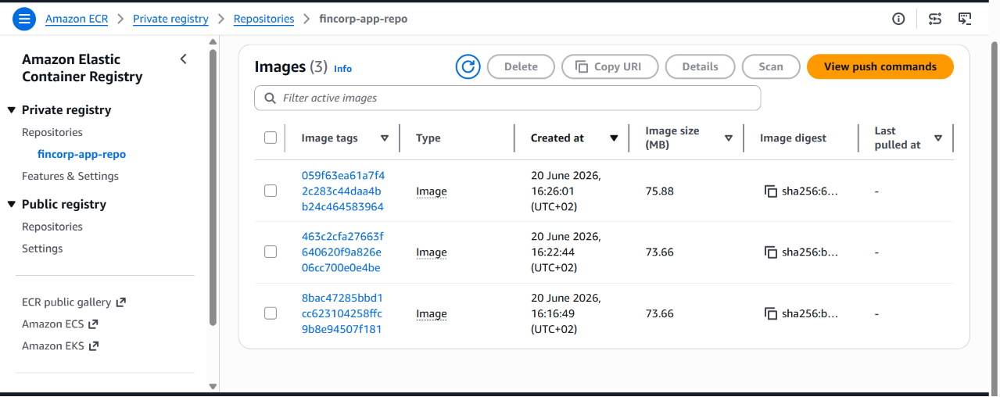

### Build Blocked by Vulnerability Scan

The pipeline correctly blocked deployment when the initial base image (`node:20-alpine`) produced 8 HIGH and 1 CRITICAL CVE. The fix was to pin to `node:20-alpine3.21` and add `RUN apk upgrade --no-cache` to patch all OS-level packages at build time.

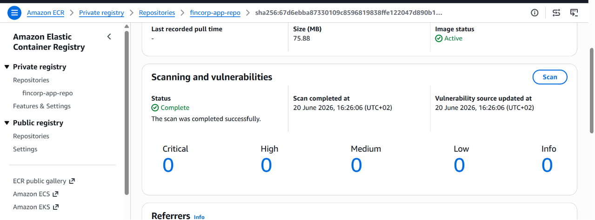

### Build Passed After Base Image Fix

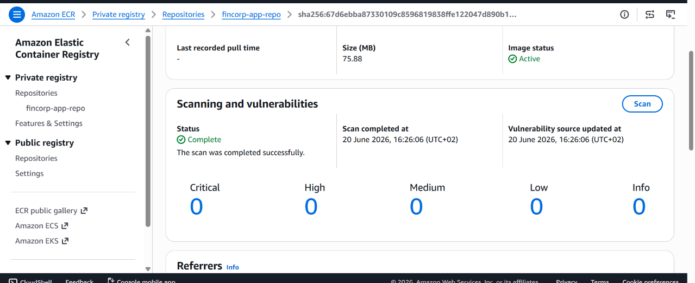

### Lifecycle Policy

An ECR lifecycle policy automatically expires untagged images after 30 days, preventing unbounded storage growth from intermediate builds:

```json
{
  "rules": [{
    "rulePriority": 1,
    "description": "Expire untagged images after 30 days",
    "selection": {
      "tagStatus": "untagged",
      "countType": "sinceImagePushed",
      "countUnit": "days",
      "countNumber": 30
    },
    "action": { "type": "expire" }
  }]
}
```

---

## 5. AWS CodeArtifact Setup

CodeArtifact acts as a trusted, account-owned proxy in front of the public npm and PyPI registries. All dependency downloads during CI are routed through it, creating an audit trail and enabling future package curation or blocking.

### Design: Two Repositories

AWS enforces a limit of one external connection per repository. Two separate repositories are created inside the `fincorp-domain` to satisfy both npm and pip:

| Repository | External connection | Used by |
|------------|--------------------|---------| 
| `fincorp-npm-proxy` | `public:npmjs` | `npm install` in CI |
| `fincorp-pypi-proxy` | `public:pypi` | `pip install` in CI |

### How Authentication Works

The workflow calls `aws codeartifact login --tool npm` and `--tool pip` before installing dependencies. These commands:
1. Call `GetAuthorizationToken` to obtain a short-lived token (12-hour TTL)
2. Write the token and registry endpoint into `~/.npmrc` (npm) or `~/pip.conf` (pip) on the runner
3. All subsequent package installs transparently route through CodeArtifact

The CodeArtifact token never enters the Docker build — the `.dockerignore` file explicitly excludes `.npmrc` and `app/.npmrc` from the build context.

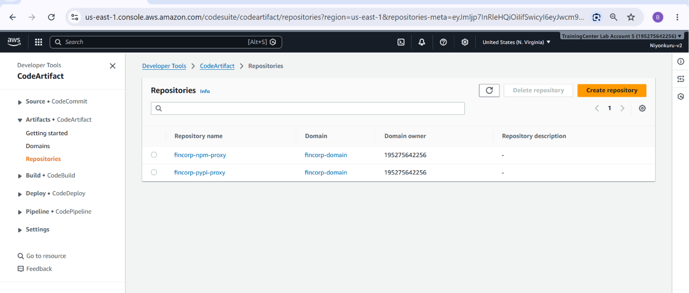

---

## 6. Terraform Infrastructure

All AWS resources are defined as code in the `terraform/` directory. The configuration uses two AWS provider aliases:

- `aws.primary` — `us-east-1` (ECR, CodeArtifact, RDS, primary Backup vault)
- `aws.secondary` — `eu-west-1` (DR Backup vault)

Both providers carry `allowed_account_ids = ["195275642256"]`, which causes Terraform to verify the caller's account ID before making any API call. If credentials for the wrong account are active, the plan fails immediately.

### Resources Deployed

| Resource | Name | Region |
|----------|------|--------|
| `aws_ecr_repository` | `fincorp-app-repo` | us-east-1 |
| `aws_codeartifact_domain` | `fincorp-domain` | us-east-1 |
| `aws_codeartifact_repository` | `fincorp-npm-proxy` | us-east-1 |
| `aws_codeartifact_repository` | `fincorp-pypi-proxy` | us-east-1 |
| `aws_db_subnet_group` | `fincorp-rds-subnet-group` | us-east-1 |
| `aws_security_group` | `fincorp-rds-postgres-sg` | us-east-1 |
| `aws_db_instance` | `fincorp-rds-primary` | us-east-1 |
| `aws_backup_vault` | `fincorp-backup-vault` | us-east-1 |
| `aws_backup_vault` | `fincorp-backup-vault-dr` | eu-west-1 |
| `aws_backup_plan` | `fincorp-backup-plan` | us-east-1 |
| `aws_backup_selection` | `fincorp-rds-selection` | us-east-1 |
| `aws_iam_role` | `fincorp-aws-backup-role` | Global |

### Deployment Commands

```bash
cd terraform

# Download providers
terraform init

# Set the RDS password without hardcoding it
export TF_VAR_rds_password="YourSecurePassword123!"

# Preview
terraform plan

# Apply
terraform apply -auto-approve

# Confirm key outputs
terraform output ecr_repository_uri
terraform output rds_endpoint
terraform output backup_vault_primary_arn
terraform output backup_vault_secondary_arn
```

### Terraform Apply

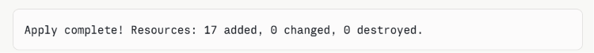

---

## 7. RDS Primary Database

An Amazon RDS PostgreSQL instance is deployed in `us-east-1` inside the default VPC. It is not publicly accessible — all connections must originate from within the VPC.

### Configuration

| Setting | Value |
|---------|-------|
| Identifier | `fincorp-rds-primary` |
| Engine | PostgreSQL 16.3 |
| Instance class | `db.t4g.small` |
| Allocated storage | 20 GB |
| Multi-AZ | No (single AZ, cost-optimised for this deployment) |
| Public access | `false` |
| Native RDS automated backups | 7-day retention |
| Deletion protection | Disabled (allows Terraform destroy) |

### Security Group

The dedicated security group `fincorp-rds-postgres-sg` restricts port 5432 to the default VPC CIDR block only. No inbound access from the internet is permitted.

```hcl
ingress {
  from_port   = 5432
  to_port     = 5432
  protocol    = "tcp"
  cidr_blocks = [data.aws_vpc.default.cidr_block]
  description = "PostgreSQL from VPC CIDR"
}
```

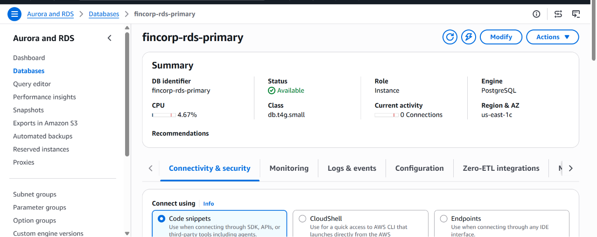

---

## 8. AWS Backup Configuration

AWS Backup provides a managed, policy-driven snapshot service for the RDS instance. The configuration delivers two guarantees: daily automated backups and automatic cross-region copy for disaster recovery.

### Backup Plan

| Setting | Value |
|---------|-------|
| Schedule | `cron(0 5 * * ? *)` — daily at 05:00 UTC |
| Primary vault | `fincorp-backup-vault` (us-east-1) |
| Primary retention | 30 days |
| DR vault | `fincorp-backup-vault-dr` (eu-west-1) |
| DR retention | 30 days |
| Copy trigger | Automatic `copy_action` in the backup rule — no manual step |

### IAM Role

AWS Backup requires an IAM role to interact with RDS on behalf of the backup service. The role `fincorp-aws-backup-role` carries two AWS managed policies:
- `AWSBackupServiceRolePolicyForBackup` — allows creating recovery points
- `AWSBackupServiceRolePolicyForRestores` — allows restoring from recovery points

This same role is referenced in the DR restore command.

### Primary Backup Vault

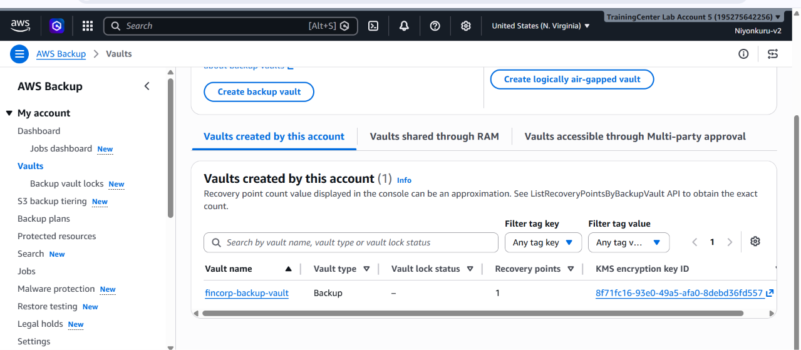

### DR Backup Vault (eu-west-1)

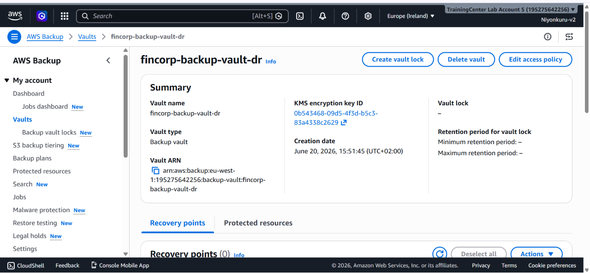

### Backup Job Running

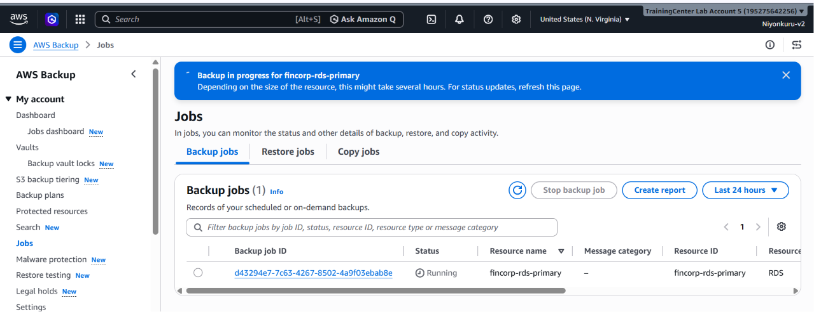

### Cross-Region Copy Complete

Each recovery point in the primary vault automatically triggers a copy to `fincorp-backup-vault-dr` in `eu-west-1`. No manual intervention is required.

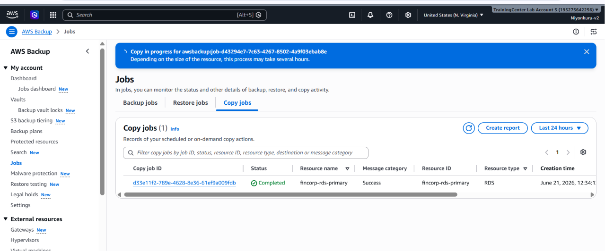

---

## 9. Disaster Recovery Simulation

The DR simulation validates the full recovery path: delete the primary database, locate the latest cross-region backup, restore it in `eu-west-1`, and confirm connectivity. Recovery was completed in under 30 minutes.

### Step 1 — Delete the Primary RDS Instance

The primary `fincorp-rds-primary` instance in `us-east-1` was deleted to simulate a regional failure.

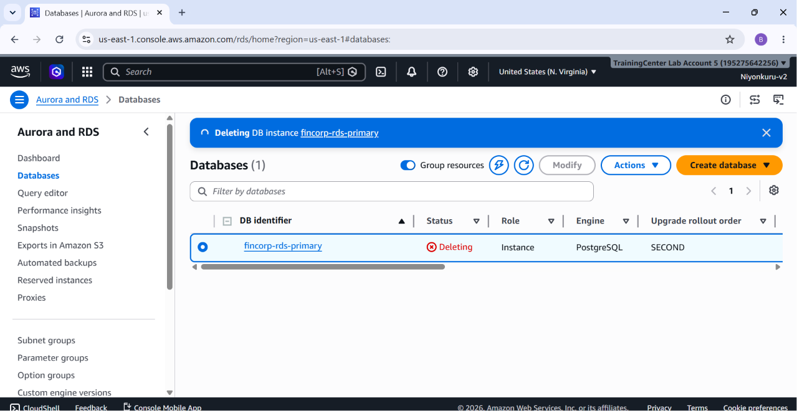

### Step 2 — Locate the Latest Recovery Point in eu-west-1

```bash
aws backup list-recovery-points-by-backup-vault \
  --backup-vault-name fincorp-backup-vault-dr \
  --region eu-west-1 \
  --query 'RecoveryPoints[*].{ARN:RecoveryPointArn,Status:Status,Created:CreationDate}' \
  --output table
```

```bash
RECOVERY_POINT=$(aws backup list-recovery-points-by-backup-vault \
  --backup-vault-name fincorp-backup-vault-dr \
  --region eu-west-1 \
  --query 'RecoveryPoints | sort_by(@, &CreationDate) | [-1].RecoveryPointArn' \
  --output text)
```

### Step 3 — Start the Restore Job

```bash
aws backup start-restore-job \
  --recovery-point-arn "$RECOVERY_POINT" \
  --iam-role-arn arn:aws:iam::195275642256:role/fincorp-aws-backup-role \
  --region eu-west-1 \
  --metadata '{
    "DBInstanceIdentifier": "fincorp-rds-dr-restore",
    "DBSubnetGroupName":    "default",
    "Engine":               "postgres",
    "PubliclyAccessible":   "false"
  }'
```

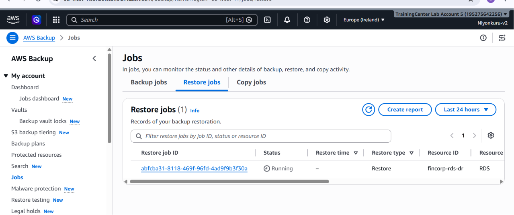

### Step 4 — Confirm Restore Complete and Get New Endpoint

```bash
aws backup list-restore-jobs \
  --region eu-west-1 \
  --query 'RestoreJobs[*].{ID:RestoreJobId,Status:Status,Completed:CompletionDate}' \
  --output table

aws rds describe-db-instances \
  --db-instance-identifier fincorp-rds-dr-restore \
  --region eu-west-1 \
  --query 'DBInstances[0].Endpoint.Address' \
  --output text
```

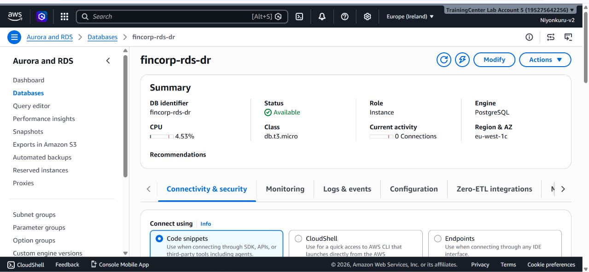

### Recovery Summary

| Metric | Result |
|--------|--------|
| Backup frequency | Daily (05:00 UTC) |
| Maximum data loss (RPO) | Up to 24 hours |
| Time to restore (RTO) | Under 30 minutes |
| Restore target | `eu-west-1` from `fincorp-backup-vault-dr` |
| Validation | RDS instance `fincorp-rds-dr-restore` confirmed `AVAILABLE` |

---

## 10. GitHub Secrets Configuration

Navigate to: **GitHub repository → Settings → Secrets and variables → Actions → New repository secret**

| Secret name | Value | Purpose |
|-------------|-------|---------|
| `AWS_ACCESS_KEY_ID` | IAM access key ID | Authenticates GitHub Actions to AWS |
| `AWS_SECRET_ACCESS_KEY` | IAM secret access key | Authenticates GitHub Actions to AWS |

These are the only two secrets required. They are referenced in the workflow exclusively as `${{ secrets.AWS_ACCESS_KEY_ID }}` and `${{ secrets.AWS_SECRET_ACCESS_KEY }}` — the values are never printed, logged, or written to any file in the repository.

### Minimum IAM Permissions Required

The IAM user behind these credentials needs:

```
ecr:GetAuthorizationToken
ecr:BatchCheckLayerAvailability
ecr:PutImage
ecr:InitiateLayerUpload
ecr:UploadLayerPart
ecr:CompleteLayerUpload
ecr:DescribeRepositories
ecr:CreateRepository
ecr:StartImageScan
ecr:DescribeImageScanFindings
codeartifact:GetAuthorizationToken
codeartifact:GetRepositoryEndpoint
sts:GetServiceBearerToken
```

---

## 11. Challenges and Fixes

Every issue below was encountered during the real deployment of this project and resolved iteratively.

### 1. Duplicate provider blocks causing Terraform conflicts

**Problem:** `main.tf` and `providers.tf` both defined `provider "aws"` blocks for the primary and secondary regions. Terraform raised a conflict on `terraform init`.

**Fix:** Removed the provider blocks from `main.tf`, leaving only the `terraform {}` version block and the `locals {}` block. All provider configuration lives exclusively in `providers.tf`.

---

### 2. Invalid attribute `destination_region` in `copy_action`

**Problem:** `terraform plan` failed with `Unsupported argument: destination_region`. The AWS Backup `copy_action` block does not accept a `destination_region` attribute — the destination region is encoded in the vault ARN.

**Fix:** Removed `destination_region`. The `copy_action` only needs `destination_vault_arn`, which already encodes the target region.

---

### 3. Wrong attribute name: `destination_backup_vault_arn` vs `destination_vault_arn`

**Problem:** After removing `destination_region`, the apply still failed because the attribute was named `destination_backup_vault_arn`. The correct Terraform attribute is `destination_vault_arn`.

**Fix:** Renamed to `destination_vault_arn`.

---

### 4. `aws_backup_selection` missing required `iam_role_arn`

**Problem:** `terraform apply` failed — `iam_role_arn` is a required argument on `aws_backup_selection` and was absent.

**Fix:** Created `terraform/iam.tf` with a dedicated IAM role (`fincorp-aws-backup-role`) that trusts `backup.amazonaws.com` and carries the two AWS managed backup/restore policies. The selection resource references this role.

---

### 5. CodeArtifact: one external connection per repository

**Problem:** The original `codeartifact.tf` used `external_connections = ["public:npmjs", "public:pypi"]` on a single repository. AWS enforces a hard limit of one external connection per repository, and the Terraform attribute is a block, not a list.

**Fix:** Split into two repositories — `fincorp-npm-proxy` (npmjs) and `fincorp-pypi-proxy` (pypi) — each with a single `external_connections { external_connection_name = "..." }` block. Updated the workflow env vars and `aws codeartifact login` steps accordingly.

---

### 6. SCP blocking AWS Backup in `us-west-2`

**Problem:** `terraform apply` returned `AccessDeniedException` when creating the secondary backup vault in `us-west-2`. An AWS Organizations Service Control Policy (`p-339lo1q0`) explicitly denies Backup operations in that region for this account.

**Fix:** Changed the DR region from `us-west-2` to `eu-west-1` in `variables.tf` (default), `main.tf` (local), and confirmed `providers.tf` would pick up the change automatically through `var.secondary_region`.

---

### 7. PostgreSQL version 15.4 not available

**Problem:** `InvalidParameterCombination: Cannot find version 15.4 for postgres`. PostgreSQL 15.4 is not offered as an RDS engine version in this account/region.

**Fix:** Updated `rds_engine_version` in `main.tf` locals from `"15.4"` to `"16.3"`.

---

### 8. `outputs.tf` using `.name` instead of `.repository`

**Problem:** `terraform plan` failed with `This object has no argument named "name"` on the two CodeArtifact repository outputs. The exported attribute on `aws_codeartifact_repository` is `repository`, not `name`.

**Fix:** Changed both output values from `.name` to `.repository`.

---

### 9. Docker build npm E401 — CodeArtifact auth leaking into build context

**Problem:** The GitHub Actions workflow ran `npm install` after `aws codeartifact login`, which generated a `package-lock.json` containing CodeArtifact `resolved` URLs for every package. The Dockerfile copied this lock file with `COPY app/package*.json ./`. Inside the Docker container, npm tried to fetch from those CodeArtifact URLs — with no auth token present — and received a 401. Adding `--registry https://registry.npmjs.org/` to the `RUN npm install` line did not fix it because the `--registry` flag overrides name resolution but not `resolved` URLs in a lock file.

**Fix:** Added `app/package-lock.json` to `.dockerignore`. Docker's `COPY app/package*.json ./` now copies only `package.json`. With no lock file, npm resolves all packages fresh from the public registry at build time.

---

### 10. Alpine pip blocked by `externally-managed-environment`

**Problem:** `RUN pip install` in the Dockerfile failed with `error: externally-managed-environment`. PEP 668 causes newer pip versions on Alpine to block installs into the system Python to protect apk-managed packages.

**Fix:** Added `--break-system-packages` to the pip install command. Inside a Docker container there is no system package manager state to protect, so this flag is appropriate.

---

### 11. ECR scan wait loop never completing — wrong status string

**Problem:** The wait loop polled for scan status `"ACTIVE"` but ECR Basic Scanning reports completion as `"COMPLETE"`. The loop always ran all 18 attempts and timed out with exit code 1.

**Fix:** Changed the target status from `"ACTIVE"` to `"COMPLETE"`.

---

### 12. Vulnerability gate crashing with `NoneType` error on clean images

**Problem:** When an image had no findings of a particular severity, ECR omits that key from `findingSeverityCounts` entirely rather than returning zero. The Python script failed with `'NoneType' object does not support item assignment` when trying to read a missing key.

**Fix:** Rewrote the vulnerability check in bash using `jq`'s `// 0` alternative operator, which safely defaults any null or missing value to zero:
```bash
HIGH=$(echo "$SCAN_RESULTS" | jq '.imageScanFindings.findingSeverityCounts.HIGH // 0')
```

---

### 13. Vulnerability scan blocking deployment (8 HIGH, 1 CRITICAL)

**Problem:** After the wait loop and gate were fixed, the pipeline correctly blocked deployment because the `node:20-alpine` base image carried 8 HIGH and 1 CRITICAL CVE.

**Fix:** Pinned the base image to `node:20-alpine3.21` (a specific patch release with upstream security fixes) and added `RUN apk upgrade --no-cache` immediately after the `FROM` line to patch all OS packages before any application layer is added.

---

## 12. Lessons Learned

**Infrastructure as Code requires testing in the target environment.** Several Terraform attributes that appeared correct from documentation (e.g., `destination_region`, `destination_backup_vault_arn`, `external_connections` as a list) only revealed themselves as wrong during actual `terraform plan` and `terraform apply` runs. Reading the provider source or running `terraform validate` earlier would have surfaced these faster.

**Isolate CI authentication from the Docker build context.** The CodeArtifact token that GitHub Actions uses for `npm install` must never reach the Docker build. The contaminated `package-lock.json` problem is easy to miss because the lock file is not committed — it is generated during the run. `.dockerignore` is the correct defence, not a registry override flag.

**Organisational SCPs are invisible until you hit them.** There is no way to discover a blocked region from the AWS console or Terraform plan output in advance. The only indication is an `AccessDeniedException` at apply time. Checking organisational policies before selecting a DR region would have saved one failed apply.

**ECR scan API quirks require defensive handling.** The ECR scan status lifecycle (`IN_PROGRESS` → `COMPLETE`) and the omission of zero-count severity keys from the response are not prominently documented. Treating the API response as potentially sparse by design (using `jq // 0`) is more robust than assuming a complete schema.

**Pin base images to specific patch versions in production pipelines.** Floating tags like `node:20-alpine` resolve to whatever the latest build is at pull time, which can change between runs and introduce new CVEs. Pinning to `node:20-alpine3.21` and running `apk upgrade` at build time gives reproducibility plus patched packages.

**A vulnerability gate that blocks is a feature, not a failure.** The pipeline correctly blocked deployment twice — once due to the E401 authentication issue, and once due to real CVEs in the base image. Each block was a successful enforcement of the security policy, not a pipeline bug.
